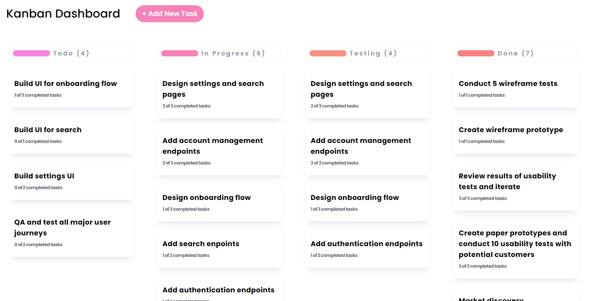

# GreatFrontEnd - Kanban




## Description
I have created a Kanban board specifically for the <b>GrateFrontEnd Assignment</b>. This board allows you to easily manage tasks by creating, editing, and moving them between four columns - To Do, In Progress, Testing, and Done. The application has been developed using React.js, Redux, and Tailwind CSS, resulting in an intuitive and user-friendly Kanban Dashboard.

### Here is the flow of how this application works
1. The user can create a task by clicking the Add Task button.
2. Popup will appear taking inputs from the user. 
3. The user can add input like ```Task Name, Description, SubTasks and Current Status```
3. When the user clicks on submit, a new task will be created with all details entered by the user.
4. The user can edit a task by clicking on any cards.
5. The user can drag tasks from one column to another.

### Here is the Proper File and Folder Structure:

```
├── public
│   ├── favicon.ico
│   ├── index.html
│   ├── logo192.png
│   ├── logo512.png
│   ├── manifest.json
│   └── robots.txt
├── src
│   ├── components
│   │   ├── SubTask.js
│   │   ├── Task.js
│   │   ├── Column.js
│   │   ├── Header.js
│   │   └── Home.js
│   ├── redux
│   │   ├── boardsSlice.js
│   │   └── store.js
│   ├── modals
│   │   ├── TaskModal.js
│   │   └── AssEditTaskModal.js
│   ├── App.js
│   ├── index.css
│   └──index.js
├── .gitignore
├── package.json
├── package-lock.json
├── tailwind.config.js
└── README.md
```


